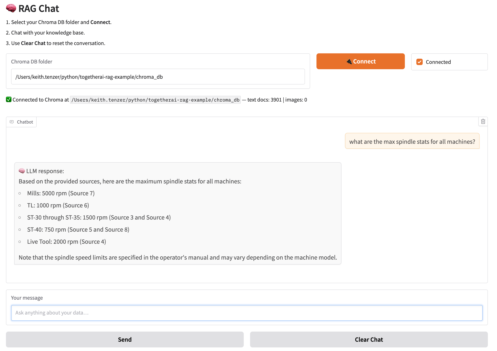

# togetherai-rag-example
RAG Ingest and Inference using together.ai enterprise platform

## Configure
Using poetry for dependency management. If you don't have poetry install it first.

Download and install dependencies
```bash
$ poetry install
```
Update .env with together.ai api KEY
```bash
$ cp .env-example .env
```
## Ingest Docs
Place documents you want to ingest in the docs directory and run ingest pipeline (I have left the manual example so remove that if not using under docs). The chromadb is written to the chroma_db directory.

```bash
$ poetry run python ingest.py
```

## Ingest Web
- Works with documentation sites, blogs, e-commerce, news sites, and more
- Automatically adapts to different website structures and content types
- Handles both static HTML and JavaScript-rendered content
- Rotates User-Agents automatically using realistic browser signatures
- Random delays between requests to appear more human-like
- Sophisticated session management with retry logic
- Respects robots.txt while being intelligent about edge cases

### Basic Configuration
```bash
$ poetry run python ingest_web.py --url https://example-spa.com --max-pages 20 --chroma ./chroma_db
```

### Advanced Configuration
```bash
poetry run python ingest_web.py \
  --url https://example.com \
  --max-pages 500 \
  --max-depth 3 \
  --restrict-domain \
  --timeout 30 \
  --delay 0.5 \
  --chunk 800 \
  --overlap 100 \
  --chroma ./chroma_db

# Conservative crawling for sensitive sites
poetry run python ingest_web.py \
  --url https://example.com \
  --max-pages 50 \
  --delay 2.0 \
  --no-ua-rotation \
  --timeout 45 \
  --chroma ./chroma_db
```

## Inference
Use either cli or UI to now chat using retrieval from chromadb.

CLI
```bash
$ poetry run python inference.py
```

```bash
UI
$ poetry run python ui.py
```
Navigate to [UI](http://127.0.0.1:7860/)



