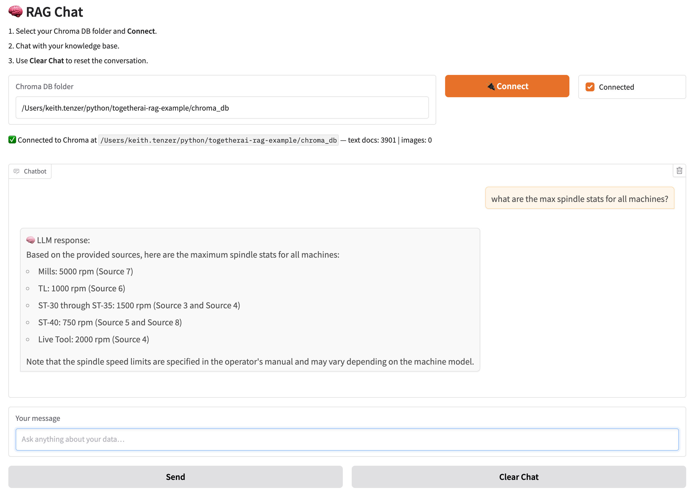

# togetherai-rag-example
RAG Ingest and Inference using together.ai enterprise platform

## Configure
Using poetry for dependency management. If you don't have poetry install it first.

Download and install dependencies
```bash
$ poetry install
```
Update .env with together.ai api KEY
```bash
$ cp .env-example .env
```
## Ingest
Place documents you want to ingest in the docs directory and run ingest pipeline. The chromadb is writted to the chroma_db directory.

```bash
$ poetry run python ingest.py
```
## Inference
Use either cli or UI to now chat using retrieval from chromadb.

CLI
```bash
$ poetry run python inference.py
```

```bash
UI
$ poetry run python ui.py
```
Navigate to [UI](http://127.0.0.1:7860/)



